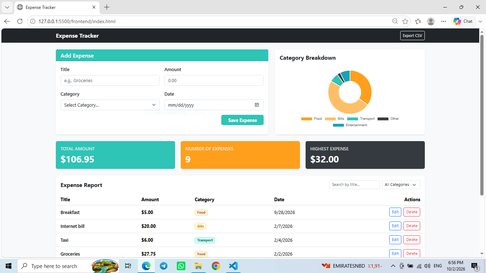
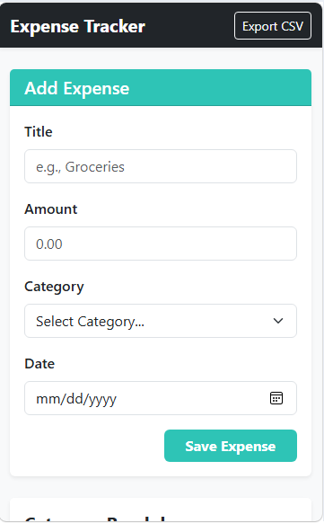
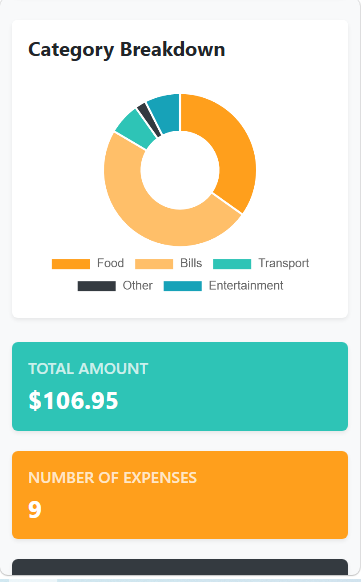
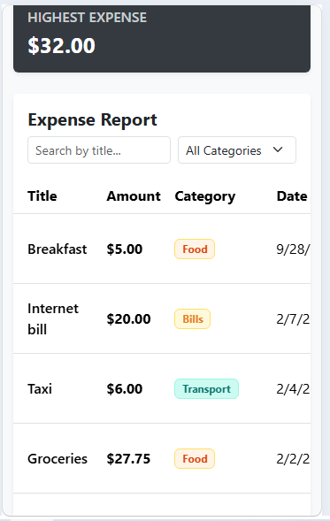

# Expense Tracker

This app helps you track your daily expenses, view a breakdown of where your money goes with charts, and easily export your data as a CSV report.

## How to run
Ensure you have the following installed on your machine:
* **Node.js** (and npm)
* **PostgreSQL**
* **VS Code**

**Backend**

1. Create the Database
2. Configure the environment variables
3. Install dependencies & start the backend : Direct the termianl to your server.js file , then type node server.js

**Frontend**

1. Open the project workspace in VS Code.
2. Open index.html file and using the live server extenstion from VS code press right click and choose Open with live server. 

## Features

- [*] Add an expense (with validation)
- [*] Delete an expense
- [*] Edit an expense
- [*] Filter by category
- [*] Summary cards (total, count, highest)
- [*] Data is saved in a PostgreSQL database
- [*] Chart to display expenses 
- [*] Export data as a CSV report

## Screenshots

## What was the hardest part?
The hardest part I faced during the backend development was dealing with CORS (Cross-Origin Resource Sharing) errors. When I tried to connect my frontend (running on a live server port) to my Node.js API (running on port 3000), the browser blocked the requests for security reasons.

How I solved it: I installed the cors middleware package in Node.js and added app.use(cors()) to my server setup. This allowed the server to safely accept requests from different origins and let the frontend communicate smoothly without being blocked by the browser.

## Video Link:
https://drive.google.com/file/d/1-_k48SsMoZ4le0QTiWclnScjZ1om_cFI/view?usp=sharing